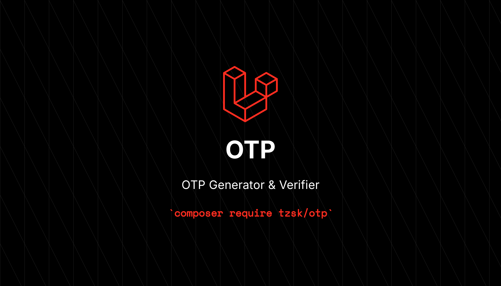

# :gift: OTP Generator & Verifier




[](https://packagist.org/packages/tzsk/otp)
[](https://github.com/tzsk/otp/actions?query=workflow%3ATests+branch%3Amaster)
[](https://packagist.org/packages/tzsk/otp)

A secure, database-free One-Time Password (OTP) generator and verifier for PHP. While primarily designed as a Laravel package, it can also be used independently in any PHP application.

## :package: Installation

Via Composer:

```bash
composer require tzsk/otp
```

To publish the configuration file for Laravel, run:

```bash
php artisan otp:publish
```

## :fire: Usage in Laravel

Import the facade class:

```php
use Tzsk\Otp\Facades\Otp;
```

**Generate an OTP:**

```php
$otp = Otp::generate($unique_secret);
// Returns - string
```

The OTP generated above will only be successfully validated if the same unique secret is provided within the default expiration time.

> **TIP:** OTPs are commonly used for user verification. The most straightforward approach to determining the `unique_secret` is to use the user's email address, phone number, or User ID. You can also be creative with the unique secret, such as using `md5($email)` to create an MD5 hash of the user's email or phone number.

**Match an OTP:**

```php
$valid = Otp::match($otp, $unique_secret);
// Returns - boolean
```

**Other Generate & Match Options:**

There are other ways of generating or matching an OTP:

```php
// Generate -

Otp::digits(8)->generate($unique_secret); // 8 Digits, Default expiry from config
Otp::expiry(30)->generate($unique_secret); // 30 min expiry, Default digits from config
Otp::digits(8)->expiry(30)->generate($unique_secret); // 8 digits, 30 min expiry

// The generate method above can be swapped with other generator methods. Ex -
Otp::make($unique_secret);
Otp::create($unique_secret);
```

Make sure to use the same configuration during validation. For example, if you specified 8 digits and a 30-minute expiration during creation, you must also specify 8 digits and a 30-minute expiration during verification.

```php
// Match - (Different Runtime)

// For the first example above
Otp::check($otp, $unique_secret); // -> false
Otp::digits(8)->check($otp, $unique_secret); // -> true

// For the second example above
Otp::check($otp, $unique_secret); // -> false
Otp::expiry(30)->check($otp, $unique_secret); // -> true

// For the third example above
Otp::check($otp, $unique_secret); // -> false
Otp::digits(8)->expiry(30)->check($otp, $unique_secret); // -> true
```

As demonstrated in the examples above, the exact configuration used to generate the OTP must be provided when matching the OTP with the secret.

**Security Advantage:** The primary advantage of requiring the same configuration during verification is that it prevents a malicious actor from using this tool to generate the same OTP for a targeted user without knowing the exact configuration parameters used.

### :ocean: Helper usage

You can use the package with the provided helper function as well:

```php
$otp = otp()->make($secret);
$otp = otp()->digits(8)->expiry(20)->make($secret);
```

## :heart_eyes: Usage outside Laravel

Install the package with Composer exactly as described above. Then, simply use the provided helper function.

**Generate:**

```php
/**
 * You will need a directory in your filesystem where the package can store data.
 * Ensure you restrict access to this directory and its files using your web server configuration (Apache or Nginx).
 */

// Let's assume the directory you created is `./otp-tmp`
$manager = otp('./otp-tmp');

/**
 * Default properties -
 * $digits -> 4
 * $expiry -> 10 min
 */

$manager->digits(6); // To change the number of OTP digits
$manager->expiry(20); // To change the mins until expiry

$manager->generate($unique_secret); // Will return a string of OTP

$manager->match($otp, $unique_secret); // Will return true or false.
```

All functionalities remain identical to those documented in the Laravel Usage section. The only difference is that you use the `$manager` instance instead of the static Facade.

**NOTE:** You don't need to specify a path if you are using Laravel. The package will automatically detect and utilize Laravel's default cache store.

Example:

```php
$manager->digits(...)->expiry(...)->generate($unique_secret);

// And...

$manager->digits(...)->expiry(...)->match($otp, $unique_secret);
```

Again, remember that when verifying an OTP, the digit and expiration configuration must match the settings used during generation.

## :microscope: Testing

```bash
composer test
```

## :date: Changelog

Please see [CHANGELOG](CHANGELOG.md) for more information on what has changed recently.

## :heart: Contributing

Please see [CONTRIBUTING](.github/CONTRIBUTING.md) for details.

## :lock: Security Vulnerabilities

Please review [our security policy](../../security/policy) on how to report security vulnerabilities.

## :crown: Credits

-   [Kazi Ahmed](https://github.com/tzsk)
-   [All Contributors](../../contributors)

## :policeman: License

The MIT License (MIT). Please see [License File](LICENSE.md) for more information.
